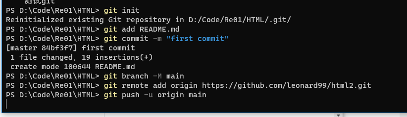

学习 git

测试 git

---


### …or create a new repository on the command line

```
echo "# html2" >> README.md
git init
git add README.md
git commit -m "first commit"
git branch -M main
git remote add origin https://github.com/leonard99/html2.git
git push -u origin main
```


### …or push an existing repository from the command line

```
git remote add origin https://github.com/leonard99/html2.git
git branch -M main
git push -u origin main
```

### …or import code from another repository

You can initialize this repository with code from a Subversion, Mercurial, or TFS project.


