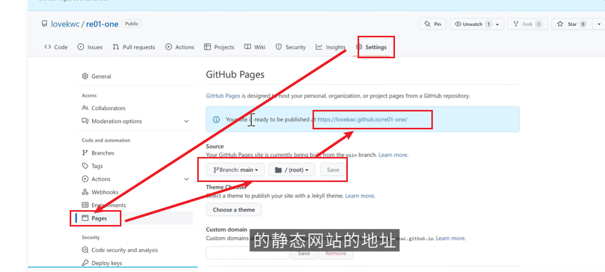

## HTML

[学习网址](https://www.runoob.com/htmldom/htmldom-tutorial.html "菜鸟")

https://leonard99.github.io/html/

- 浏览器图标
  `<link rel="stylesheet" href="./mage/2.png" sizes="50*50">`
- 生效样式

`<link rel="shortcut icon" href="./mage/favicon.ico" type="image/x-icon" />`

## CSS

应用 css 文件

`<linkrel="stylesheet"type="text/css"href="./css/index.css"/>`

max-width

link

三种方式：

- 内联
- 文件内样式
- 文件外样式

  优先级：近水楼台先得月

## Github

1. 发创建仓库
2. 上传文件
3. 静态网页发布，得到网址

## Git

[Git 教程 | 菜鸟教程 (runoob.com)](https://www.runoob.com/git/git-tutorial.html)

配置环境

搜素 git commit 风格

回退

### git-github

